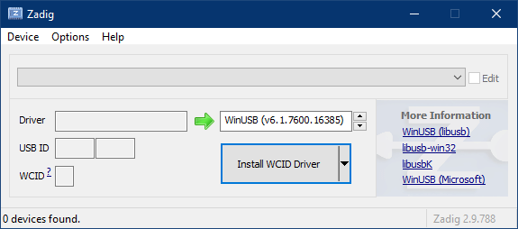

+++
date = 2024-07-04
draft = false
title = "Getting Started with Software Defined Radio"
+++

## Hardware

1. Buy the official `RTL-SDR BLOG V4` dongle from the [RTL-SDR Store](https://www.rtl-sdr.com/buy-rtl-sdr-dvb-t-dongles/)

## Software

### Install WinUSB Driver

1. Download [Zadig](https://zadig.akeo.ie/)

2. Run the application

    

3. Connect the `RTL-SDR BLOG V4` dongle

4. Select the `Bulk-In, Interface (Interface 0)` and click the `Install Driver` button

5. Select the `Bulk-In, Interface (Interface 1)` and click the `Install Driver` button

### (Option 1) Install SDR#

1. Download [SDR#](https://airspy.com/download/)

2. Extract the archive

3. Run the application

4. Select `RTL-SDR` as source

5. Click the play button

### (Option 2) Install SDR++

1. Download [SDR++](https://github.com/AlexandreRouma/SDRPlusPlus/releases/tag/nightly)

2. Extract the archive

3. Run the application

4. Select `RTL-SDR` as source

5. Click the play button
